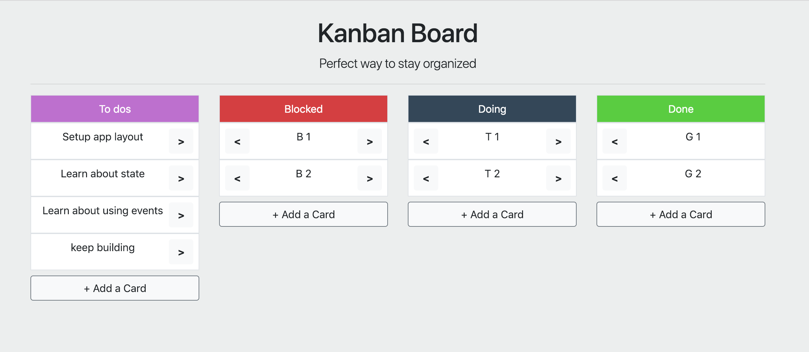

# Kanban App

1. Basic HTML/CSS layout - `start` branch
1. Finished React app layout - `layout` branch (Lab 1: Solution)
1. Functional Kanban App - `final` branch (Lab 2: Solution)
1. Functional Kanban App with redux - `redux-final` branch (Lab 3: Solution)

### Lab #3: Add redux to the react app
1. Full state should be managed via Redux
1. All components are functional components